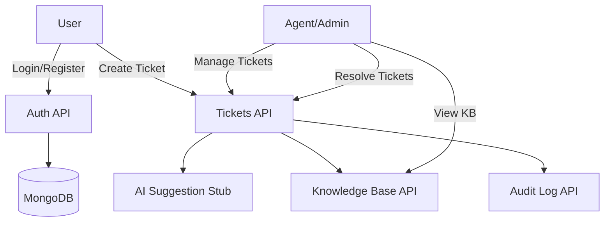

# HelpDesk AI – Ticketing System

A simplified **HelpDesk Ticketing Application** built as part of the **Wexa AI Fresher Assignment**.  
The system allows users to create support tickets, agents/admins to manage them, and integrates AI suggestions for faster resolution.

---

## 📌 Features

- **Authentication** (JWT-based Login & Register)  
- **Role-based access** (User, Agent, Admin)  
- **Tickets**  
  - Create, view, list tickets  
  - AI suggestion + confidence score  
  - Audit log timeline  
  - Mark as resolved  
- **Knowledge Base (KB)**  
  - List articles  
  - Add/edit (Admin only)  
- **Dashboards**  
  - User → Manage own tickets  
  - Agent → Resolve pending tickets  
  - Admin → View stats + all tickets  
- **Settings Page** → Confidence threshold (simple toggle for AI suggestions)

---

## ⚙️ Tech Stack

- **Frontend**: React (Vite) + TailwindCSS  
- **Backend**: Node.js + Express.js  
- **Database**: MongoDB (Mongoose)  
- **Auth**: JWT  
- **AI**: Stub workflow 

---

## 🚀 Project Setup

### 1️⃣ Backend
```bash
cd server
npm install
```

- Create a `.env` file:
```env
MONGO_URI=mongodb://localhost:27017/helpdesk
JWT_SECRET=supersecret
PORT=5000
```

- Start server:
```bash
npm run dev
```

### 2️⃣ Frontend
```bash
cd client
npm install
npm run dev
```

App will run on:  
👉 Frontend: http://localhost:5173  
👉 Backend: http://localhost:5000  

---

## 🏗️ System Architecture



---

## 🧪 Testing

- Run backend tests:
```bash
cd server
npm test
```

- Run frontend:
```bash
cd client
npm run dev
```

- Thunderclient  (for API testing).

---

## 🐳 Docker (Optional)

```bash
docker-compose up --build
```

---

## 📹 Demo Video

👉 [Demo Video Link Here] (upload Loom/Drive/YouTube)

---

## 🌐 Deployment

- **Frontend (Vercel/Netlify)** → https://helpdesk-ai-frontend.vercel.app
- **Backend (Render/Heroku)** → https://helpdesk-ai-frontend.onrender.com 
- **Database (MongoDB Atlas)**  

---

👨‍💻 **Developed by**: Viraj Mulik  

